# 💻 Lapo Store - Laptop E-Commerce Mobile App

A premium, modern e-commerce application for laptop enthusiasts, engineered with **Clean Architecture** to provide a seamless shopping experience.
The app features a cutting-edge UI/UX, robust backend integration with **Supabase**, and highly efficient state management.

## 📸 App Screenshots

### 🏁 Startup & Introduction

  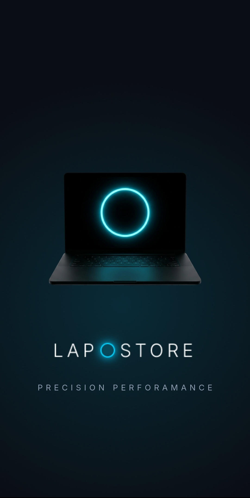
  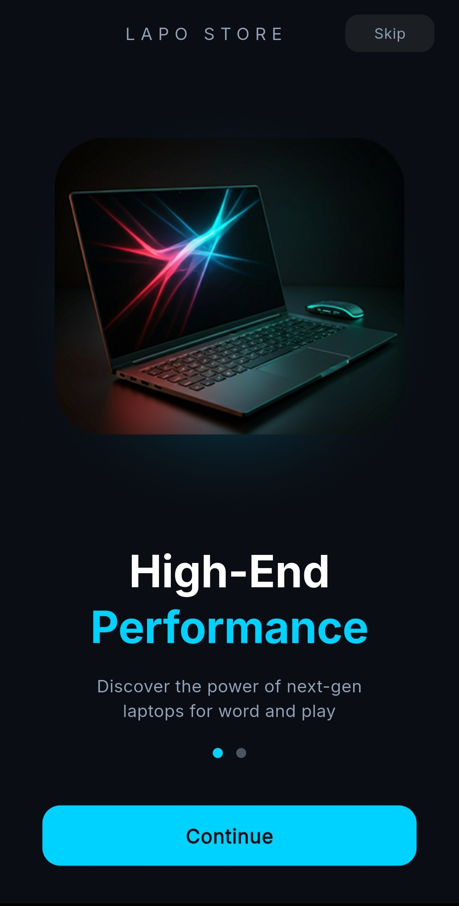
  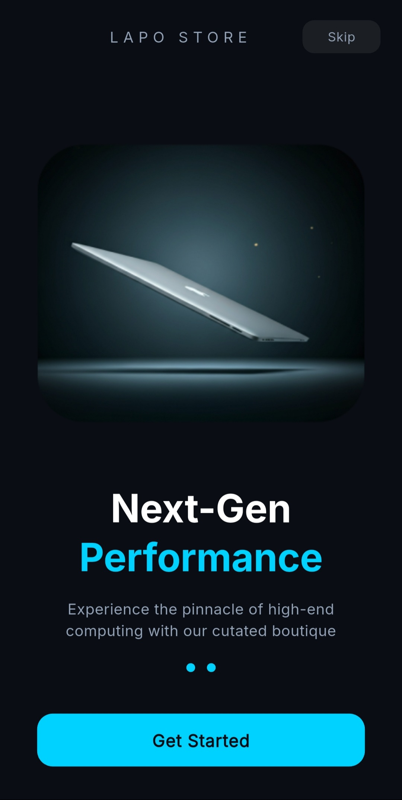

### 🔐 Authentication & Access

  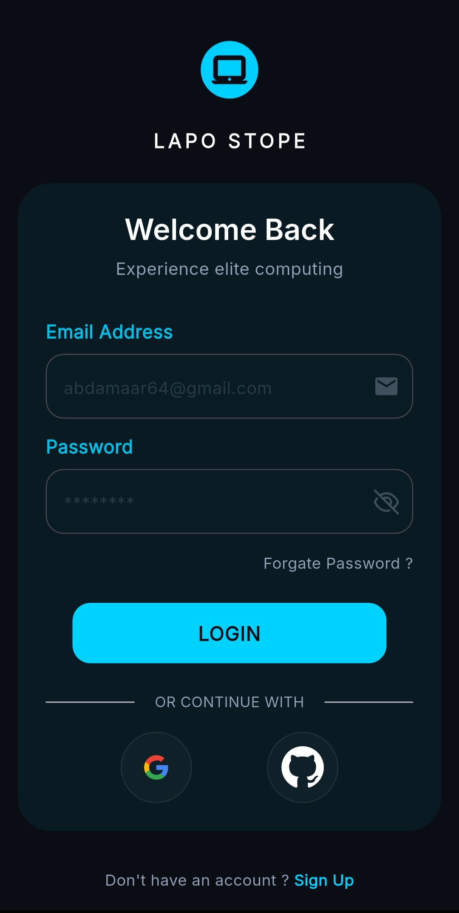
  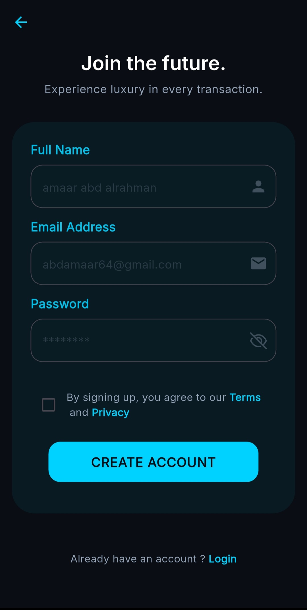
  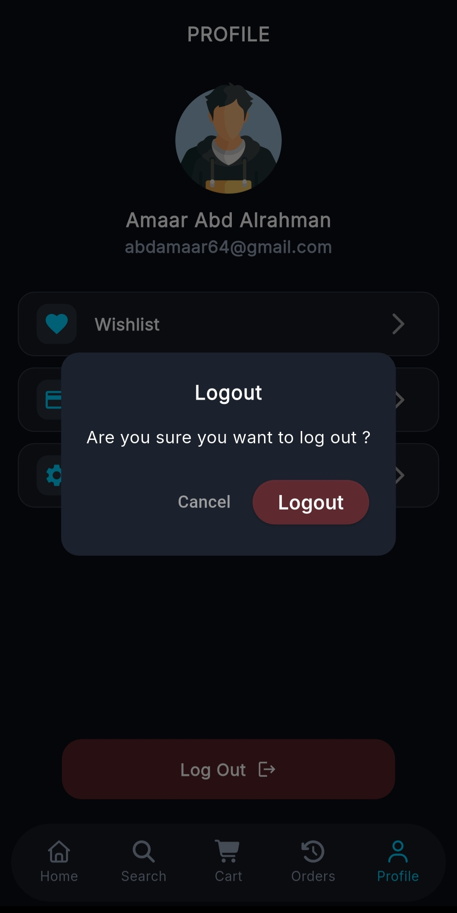

### 🏠 Main Shopping Experience

  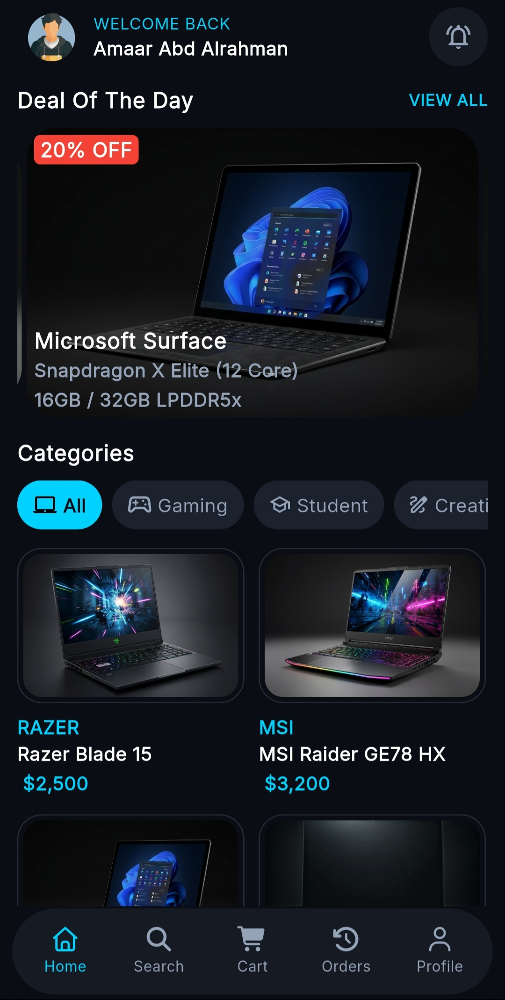
  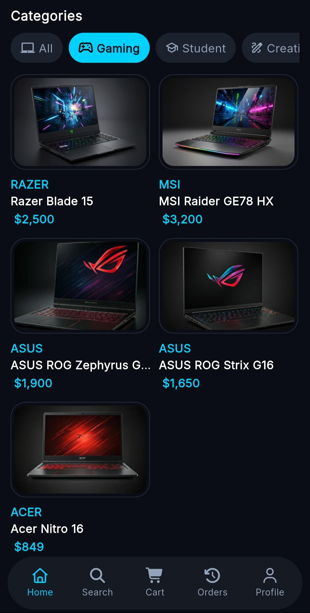
  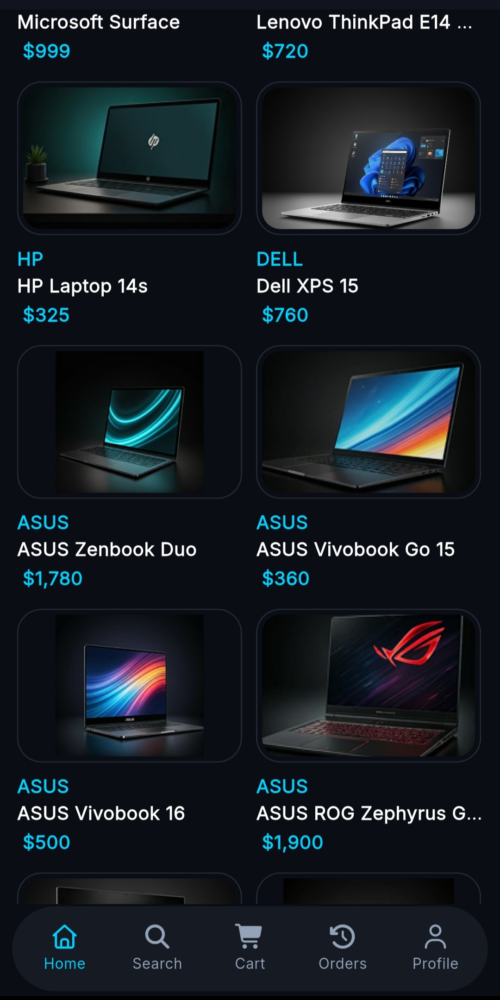
  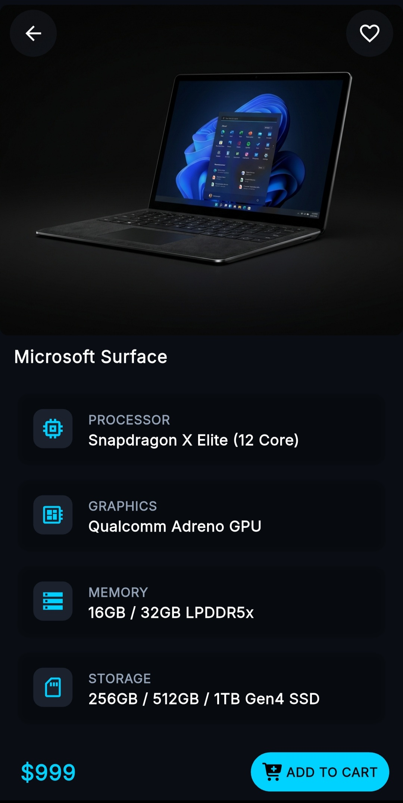

### 🔍 Search Intelligence

  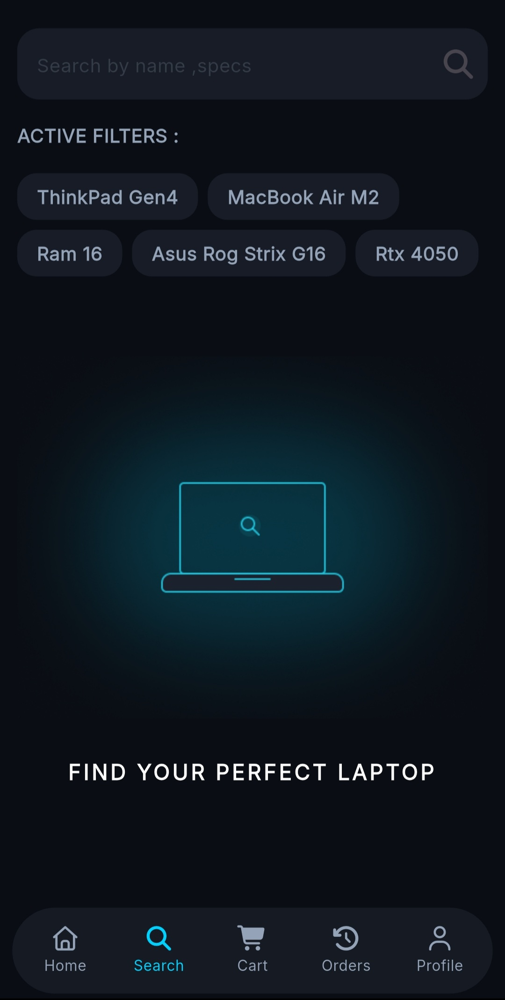
  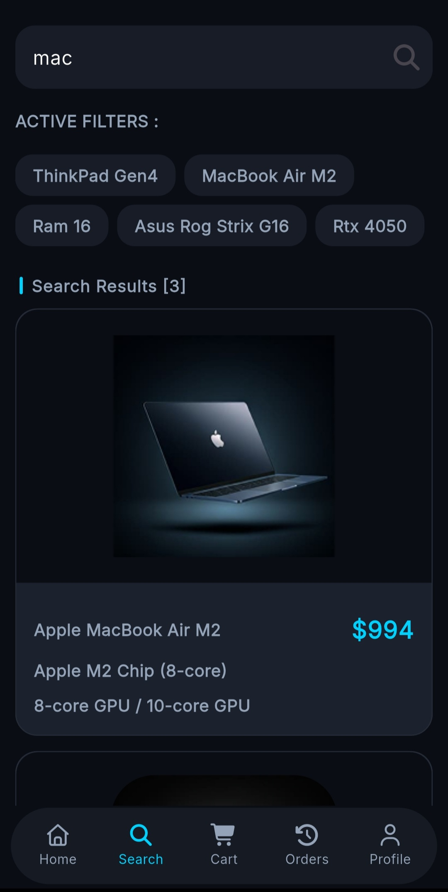
  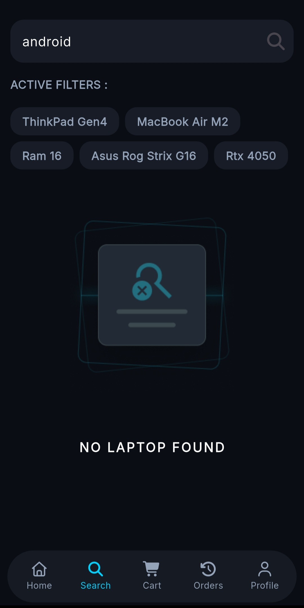

### 🛒 Cart & Checkout Flow

  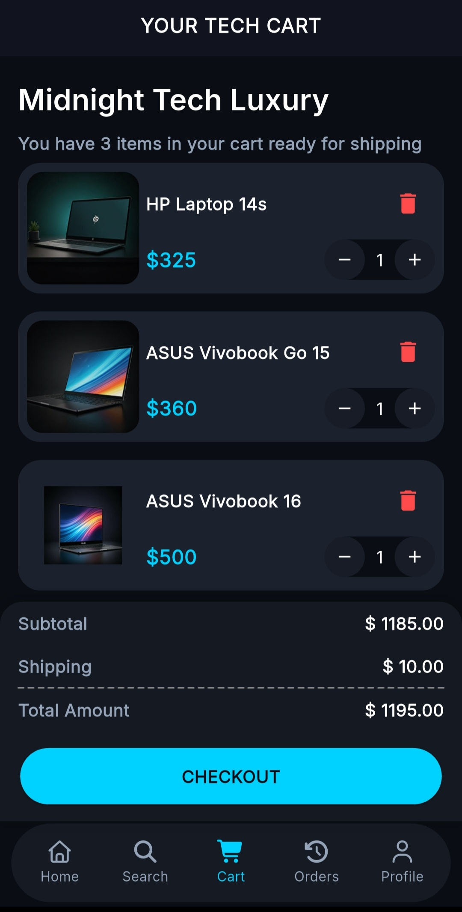
  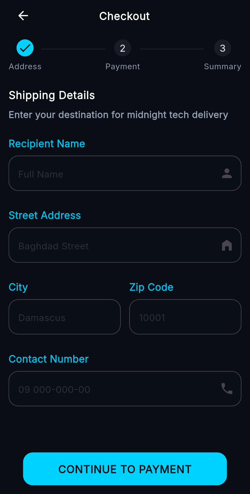
  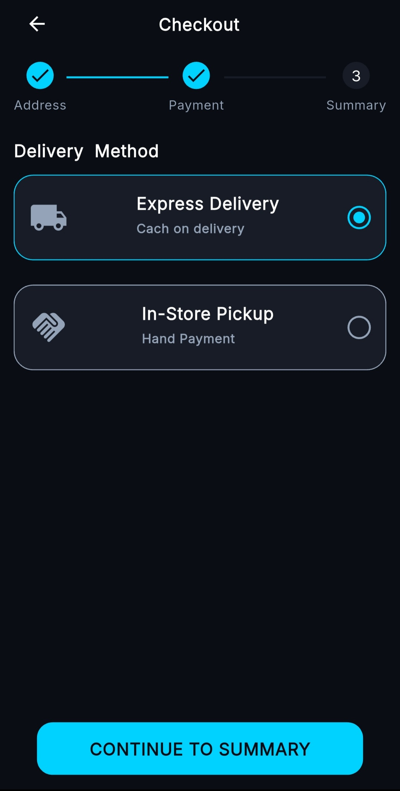
  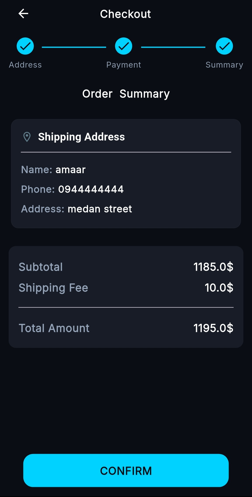

### 👤 User Space & Status

  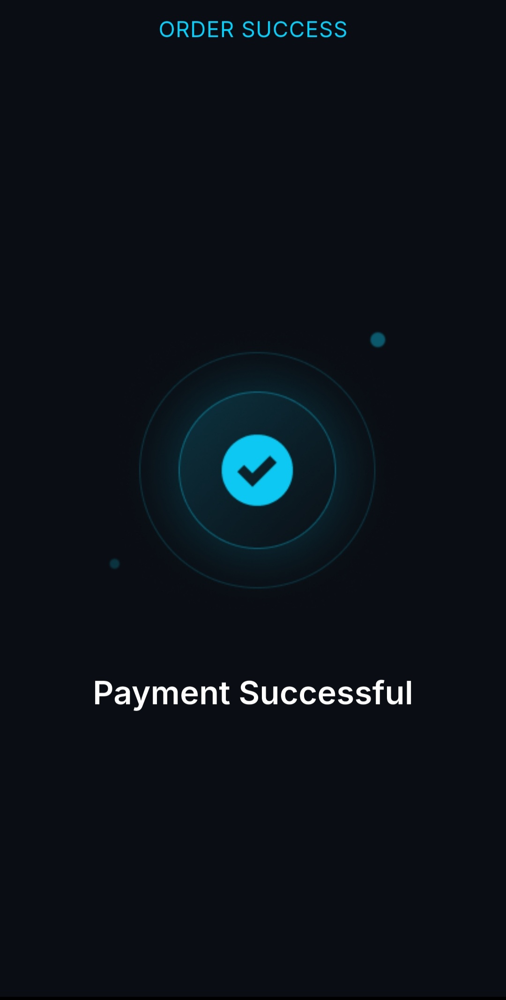
  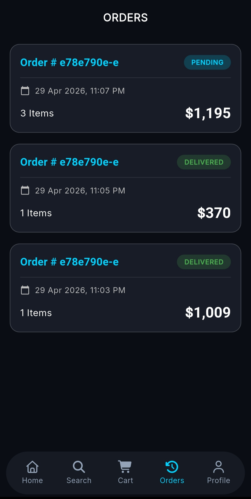
  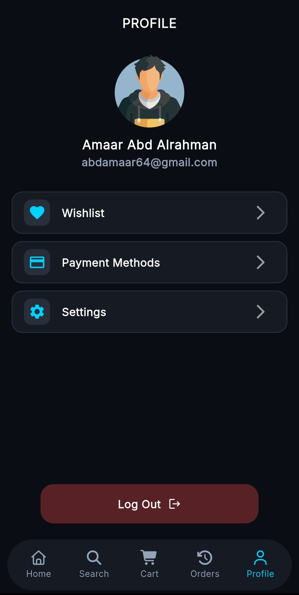

## 🛠 Technical Implementation
This project showcases high-level Flutter development skills with a focus on scalability and modern design:

* **UI/UX Design:** Personally designed and prototyped using **Google Stitch**, following modern Material Design standards for a seamless user experience.
* **Architecture:** Strictly implemented **Clean Architecture** (Data, Domain, Presentation) to ensure decoupled code and ease of maintenance.
* **Backend & Auth (Supabase):** * **Supabase Auth:** Secure user access via Email/Password and Social Providers (Google & GitHub).
    * **Database:** Managed via Supabase Tables with relational mapping for products, users, and orders.
    * **Storage:** Leveraged Supabase Storage for high-quality product images and assets.
* **State Management:** Powered by **Cubit (Bloc)** for clean, predictable, and reactive UI updates.
* **Local Persistence:** Integrated **Shared Preferences** for storing lightweight user settings and local session caching.

## 🏗 Project Structure & Patterns

### 1. Presentation Layer
* **UI Components:** Highly reusable widgets and modular screens.
* **Cubit Logic:** Handles UI-related events and maintains clean state transitions.

### 2. Domain Layer
* **Entities:** Core business logic models.
* **Repositories (Interfaces):** Defining the contract for data operations.

### 3. Data Layer
* **Models:** Extended entities with JSON mapping for Supabase interaction.
* **Repositories (Implementations):** Managing data flow between Supabase Remote sources and local caching.
* **Data Sources:** Direct integration with **Supabase Client SDK**.

## 🚀 Key Features
* **Unified Auth System:** Social Login (Google/GitHub) and traditional Email/Password via Supabase.
* **Advanced Product Discovery:** Multiple Home layouts and an intelligent search system.
* **Comprehensive Checkout:** A detailed 3-step checkout process (Address, Shipping, Summary).
* **High Performance:** Fast data fetching and real-time updates.
* **Modern Aesthetic:** Optimized for a smooth and intuitive laptop shopping experience.

---
*Developed with ❤️ by **Amaar Abd Alrahman***
